# Buddy

```

  e88'Y88 888     ,e, 888 888 ,e,                  
 d888  'Y 888 ee   "  888 888  "  888 8e   e88 888 
C8888     888 88b 888 888 888 888 888 88b d888 888 
 Y888  ,d 888 888 888 888 888 888 888 888 Y888 888 
  "88,d88 888 888 888 888 888 888 888 888  "88 888 
                                            ,  88P 
                                           "8",P"  

```

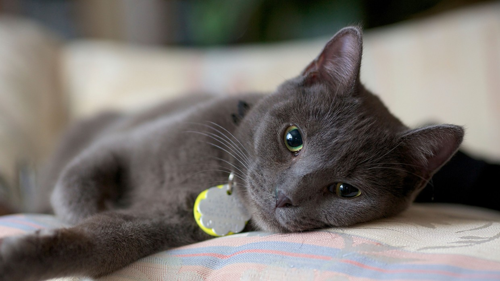


## About this project

- [x] Create a repository and add image
- [x] Commit
- [ ] Analysis and more analysis
  - [ ] split backup readme into separate files
  - [ ] use append to extend csv, not just over-writte it


# Facts

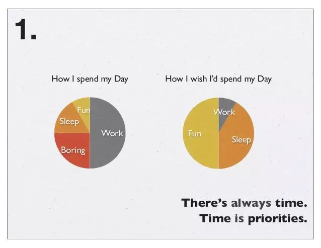

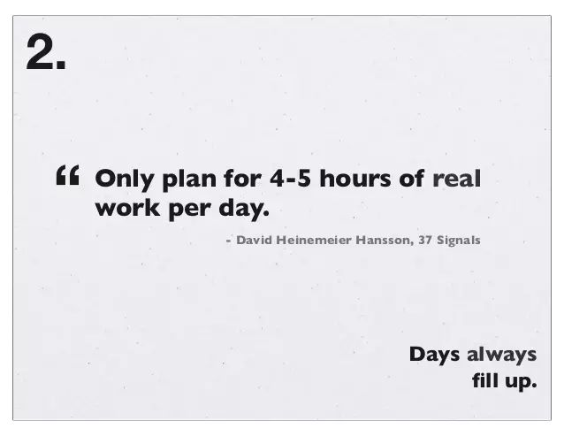


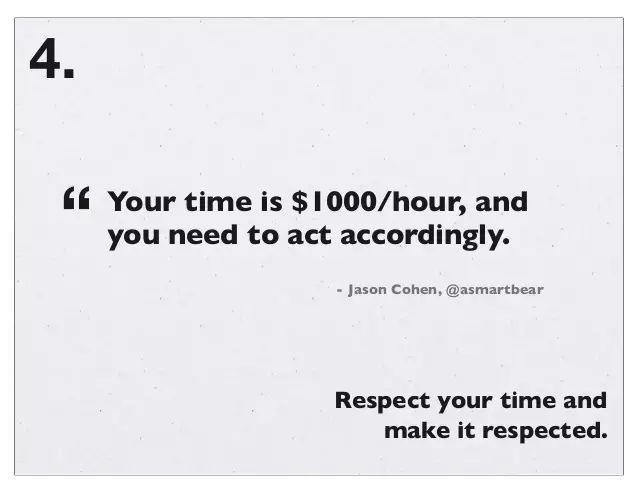

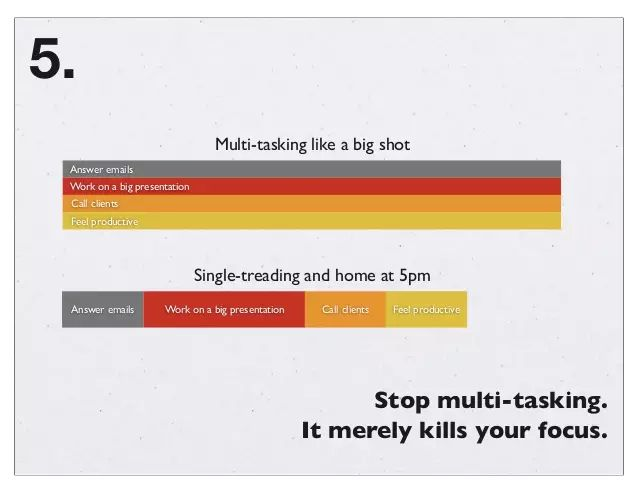

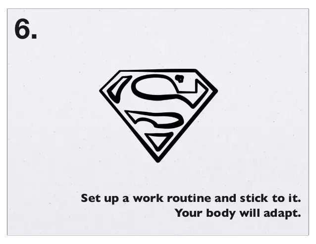

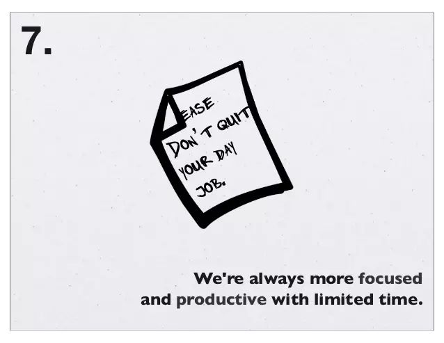


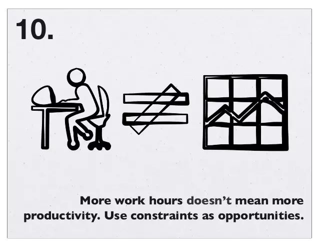


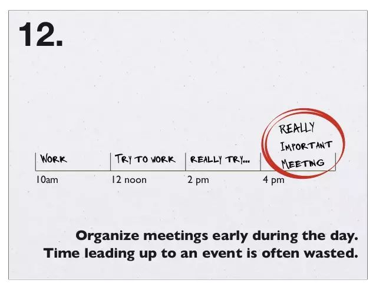

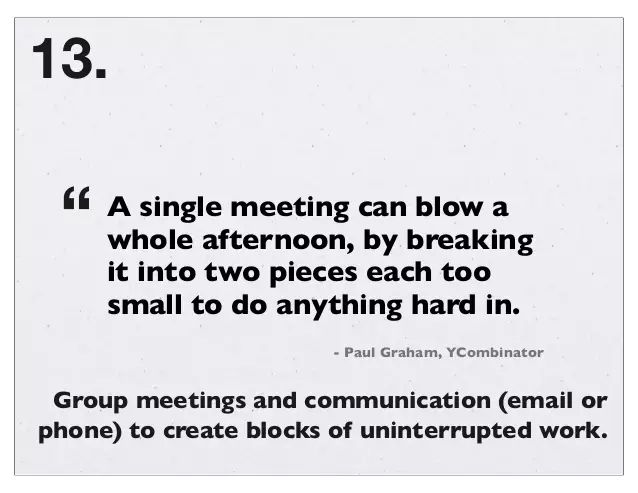


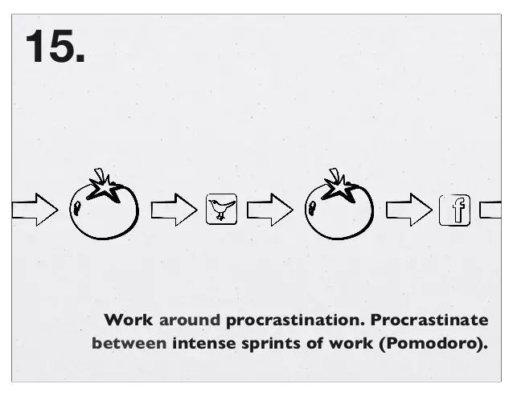

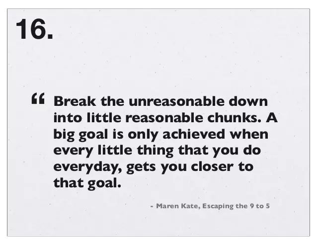

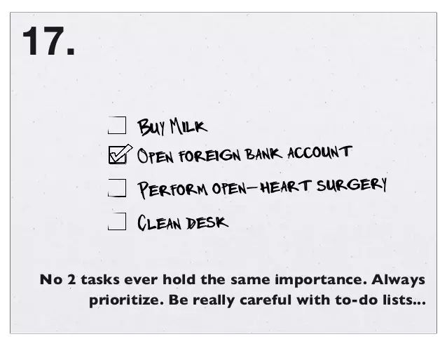

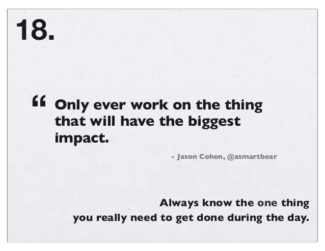

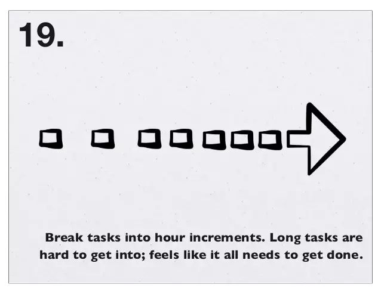

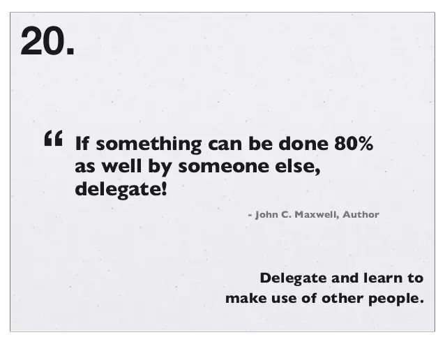

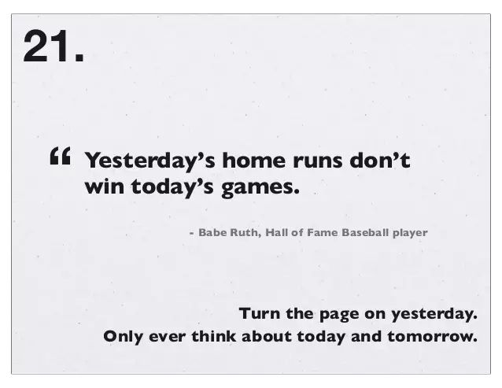

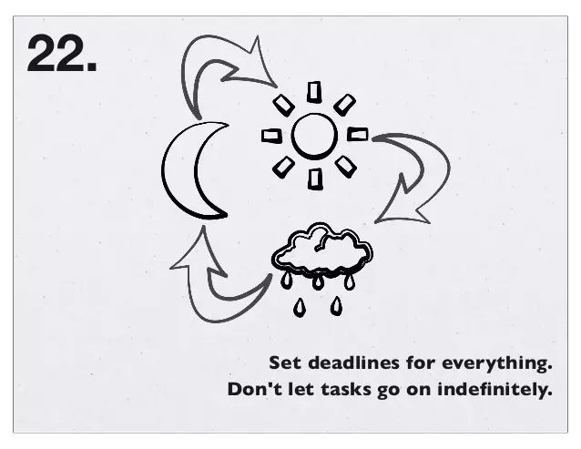

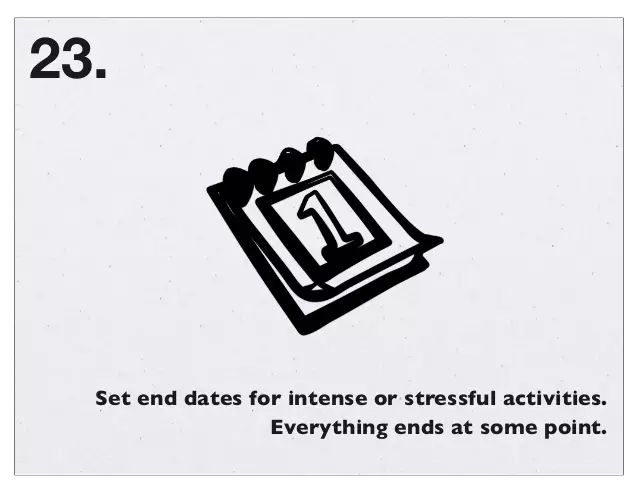


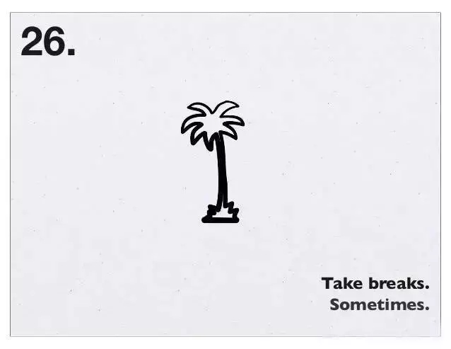
